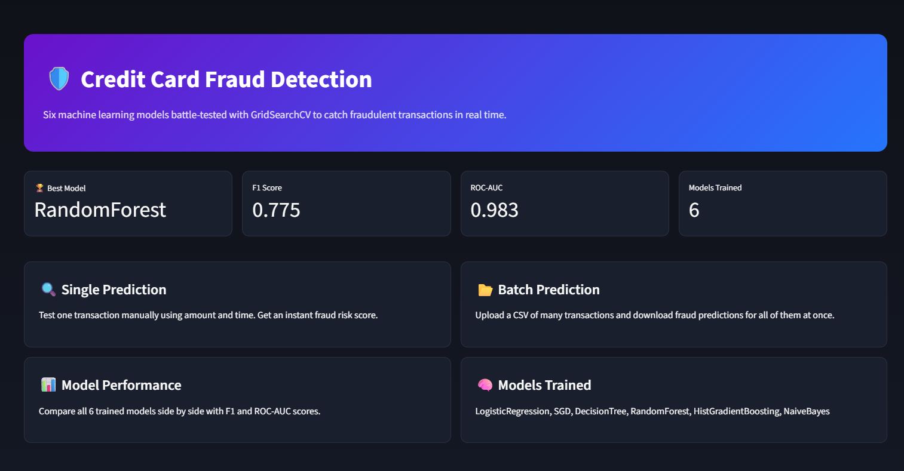
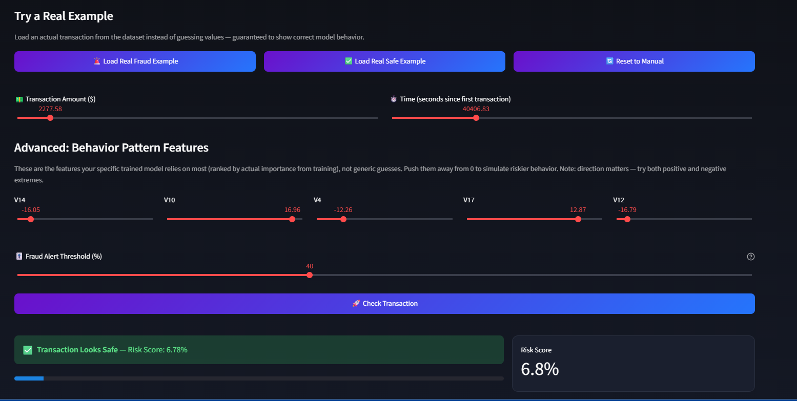
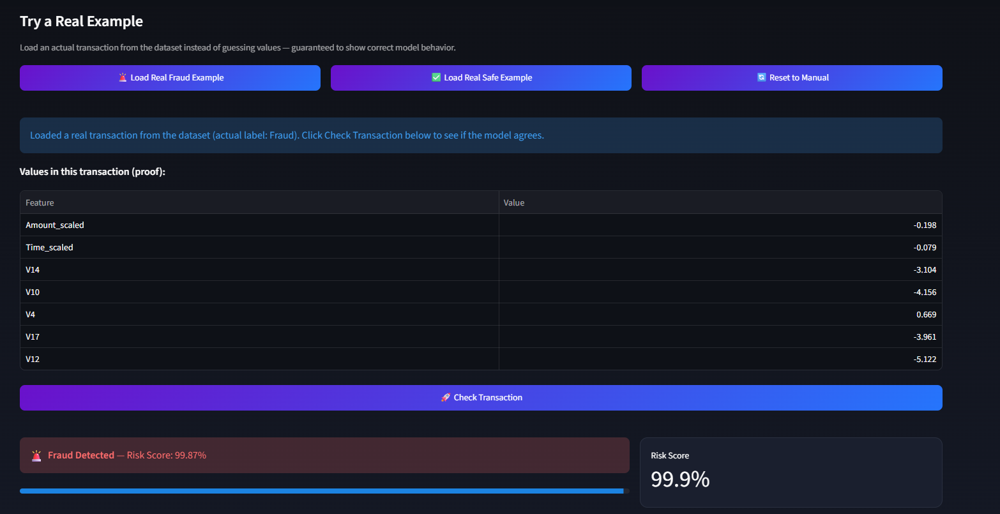
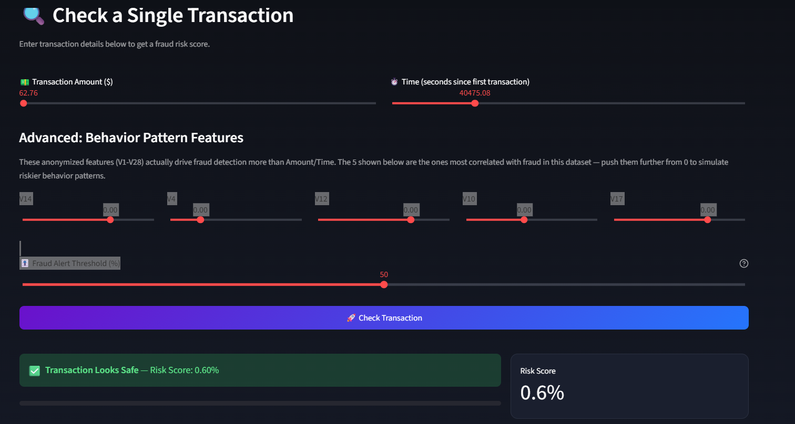
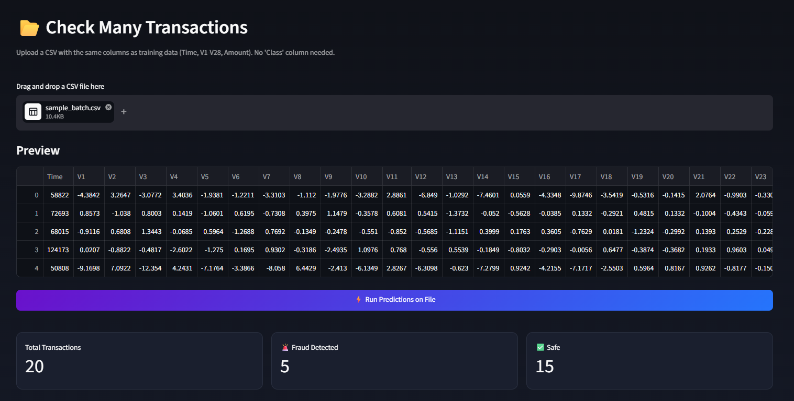
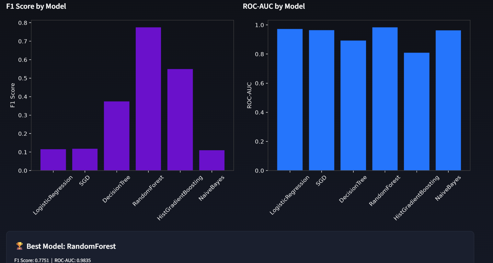

# 🛡️ Fraud Shield — Credit Card Fraud Detection

A machine learning web app that detects fraudulent credit card transactions in real time. Six classification models were trained and tuned with GridSearchCV, compared on imbalanced-data metrics, and the best-performing model was deployed behind an interactive Streamlit dashboard.

**🔗 Live App:** [musfirah-credit-card-fraud-detection.streamlit.app](https://musfirah-credit-card-fraud-detection.streamlit.app/)

---

## 📌 Overview

Credit card fraud detection is a textbook example of an **imbalanced classification problem** — only 492 of 284,807 transactions in this dataset (0.17%) are fraudulent. A model that predicts "not fraud" every single time would still be 99.8% "accurate" while catching zero fraud. This project tackles that challenge head-on: training multiple models, evaluating them with metrics that actually matter for imbalanced data (Precision, Recall, F1, ROC-AUC), and building a full interactive app around the winner.

## 🎯 Problem Statement

Given anonymized transaction features, predict whether a transaction is fraudulent — while correctly handling the extreme class imbalance so the model doesn't just default to "safe" for everything.

## 📊 Dataset

- **Source:** [Credit Card Fraud Detection — Kaggle (ULB)](https://www.kaggle.com/datasets/mlg-ulb/creditcardfraud)
- **Rows:** 284,807 transactions
- **Fraud cases:** 492 (0.17%)
- **Features:** `Time`, `Amount`, and `V1`–`V28` (anonymized PCA components), `Class` (target: 0 = not fraud, 1 = fraud)

## 🧠 Approach

1. **Exploratory Data Analysis** — examined class distribution to confirm the imbalance problem before choosing an evaluation strategy.
2. **Preprocessing** — scaled `Amount` and `Time` independently with `StandardScaler` (the only two unscaled raw features; `V1`–`V28` are already PCA-transformed).
3. **Train/test split** — stratified 80/20 split to preserve the fraud ratio in both sets.
4. **Model training** — six classifiers tuned via `GridSearchCV` with 3-fold cross-validation, optimized on F1 score (not accuracy, which is misleading on imbalanced data):
   - Logistic Regression
   - SGD Classifier
   - Decision Tree
   - Random Forest
   - HistGradientBoosting
   - Gaussian Naive Bayes
5. **Evaluation** — Accuracy, Precision, Recall, F1, ROC-AUC, and confusion matrices for every model.
6. **Model selection** — best model chosen by F1 score, then retrained on the full dataset and saved with `joblib`.
7. **Feature importance** — extracted directly from the winning model (`feature_importances_` or `coef_`) so the app's interactive controls reflect what the model actually learned, not generic assumptions.
8. **Deployment** — built a multi-page Streamlit app for single predictions, batch CSV predictions, and model performance comparison.

## 🏆 Model Results

| Model | Accuracy | Precision | Recall | F1 Score | ROC-AUC |
|---|---|---|---|---|---|
| **Random Forest** ⭐ | 99.92% | 0.730 | 0.827 | **0.775** | 0.983 |
| HistGradientBoosting | 99.81% | 0.465 | 0.673 | 0.550 | 0.808 |
| Decision Tree | 99.55% | 0.246 | 0.786 | 0.375 | 0.892 |
| SGD Classifier | 97.64% | 0.063 | 0.918 | 0.118 | 0.964 |
| Logistic Regression | 97.57% | 0.061 | 0.918 | 0.115 | 0.972 |
| Naive Bayes | 97.64% | 0.059 | 0.847 | 0.110 | 0.963 |

**Random Forest** was selected as the final model — it delivers the best balance between catching fraud (82.7% recall) and avoiding false alarms (73% precision), reflected in its top F1 score.

> Note: several models show high Recall but low Precision — a direct consequence of the extreme class imbalance and `class_weight='balanced'`, which deliberately trades some false alarms for better fraud coverage. This trade-off is configurable in the app via the Fraud Alert Threshold slider.

> ⚠️ **Why Accuracy is misleading here:** this dataset is so imbalanced (0.17% fraud) that a "lazy" model — one that never flags anything as fraud — would still score ~99.83% accuracy while catching **zero** fraud cases. In other words, high accuracy on this dataset proves nothing on its own. That's why Accuracy is listed above for completeness only — **F1 and ROC-AUC are the metrics that actually determine model selection** in this project.

## ✨ App Features

### 🏠 Home
Live snapshot of the best model, its scores, and a summary of all 6 models trained.

### 🔍 Single Prediction
Test one transaction manually via sliders (Amount, Time, and the model's top 5 most influential features), or load a **real transaction** straight from the dataset to see guaranteed-accurate model behavior, complete with a values table as proof. Includes an adjustable **Fraud Alert Threshold** to explore the precision/recall trade-off.

### 📂 Batch Prediction
Upload a CSV of many transactions and get fraud predictions for all of them at once, with summary stats and a downloadable results file.

### 📊 Model Performance
Full comparison table and charts (F1, ROC-AUC) across all 6 trained models.

### 👤 About Me
Developer profile and other portfolio projects.

## 📸 Screenshots

**Home**


**Single Prediction**


**Fraud Detected**


**Transaction Safe**


**Batch Prediction**


**Model Performance**


## 🛠️ Tech Stack

- **Language:** Python
- **ML:** scikit-learn (Logistic Regression, SGD, Decision Tree, Random Forest, HistGradientBoosting, Naive Bayes), GridSearchCV
- **Data:** Pandas, NumPy
- **Visualization:** Matplotlib, Seaborn
- **App/Deployment:** Streamlit, Streamlit Community Cloud
- **Model persistence:** joblib

## 📁 Project Structure

```
Credit-Card-Fraud-Detection/
│
├── data/
│   └── creditcard.csv
├── models/
│   ├── best_model.pkl
│   ├── scaler_amount.pkl
│   ├── scaler_time.pkl
│   ├── results.csv
│   ├── feature_importance.csv
│   └── sample_transactions.csv
├── graphs/
│   └── confusion_matrices (per model)
├── screenshots/
├── testing/
│   └── sample batch CSVs for testing the app
├── images/
│   └── profile.jpg
├── train_models.py
├── app.py
├── requirements.txt
└── README.md
```

## 🚀 Running Locally

```bash
git clone https://github.com/musfirah-kashan/Credit-Card-Fraud-Detection.git
cd Credit-Card-Fraud-Detection
pip install -r requirements.txt
python train_models.py   # trains all 6 models and saves artifacts to models/
streamlit run app.py
```

## 🔮 Future Improvements

- Add SMOTE / oversampling comparison against `class_weight='balanced'`
- SHAP-based explainability for individual predictions
- Precision-Recall curve alongside ROC-AUC (more informative under heavy imbalance)
- Live threshold tuning tied directly to a cost-based business metric

## 👩‍💻 About Me

**Musfirah Kashan** — Aspiring Data Scientist, building a portfolio of data analysis and machine learning projects.

- GitHub: [musfirah-kashan](https://github.com/musfirah-kashan)
- LinkedIn: [musfirah-kashan](https://www.linkedin.com/in/musfirah-kashan-487aa626a/)
- Email: musfirah22feb@gmail.com

## 📄 Dataset Credit

Dataset provided by the [Machine Learning Group at ULB (Université Libre de Bruxelles)](https://www.kaggle.com/datasets/mlg-ulb/creditcardfraud), collected and analyzed during a research collaboration on big data mining and fraud detection.
